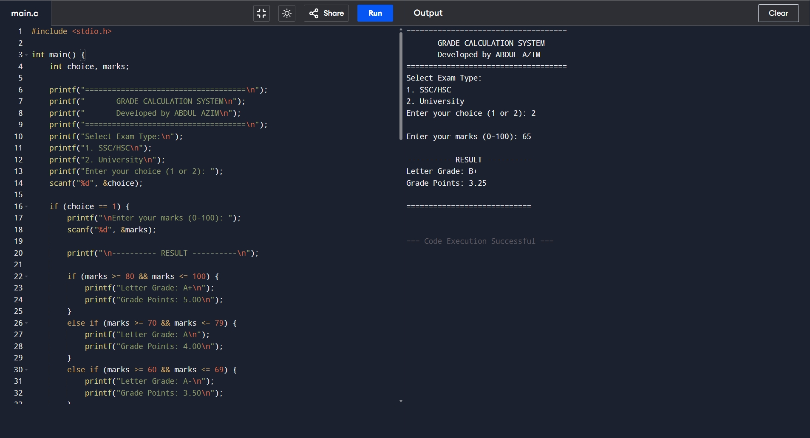

# Grade Calculator - Bangladesh SSC/HSC & University System

A web-based grade calculator that works in any browser. Built with HTML, CSS, and JavaScript.

## Features

- Two grading systems: SSC/HSC and University
- Real-time grade calculation
- Mobile responsive design
- No installation required

## How to Use

1. Select exam type (SSC/HSC or University)
2. Enter your marks (0-100)
3. Click "Calculate Grade"
4. View your letter grade and grade points

## Local Development

Simply open `index.html` in any web browser.

## Screenshot

## Author

Student Project for University Admission

## License

MIT License
